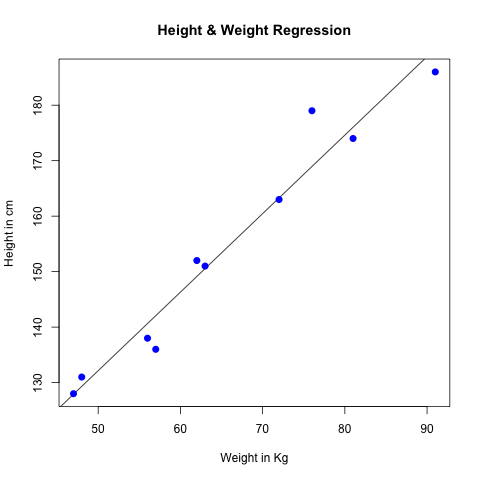

This is an [R Markdown](http://rmarkdown.rstudio.com) Notebook. When you execute code within the notebook, the results appear beneath the code. 

Below is a example Linear Regression code.

```{r}
# The predictor vector.
x <- c(151, 174, 138, 186, 128, 136, 179, 163, 152, 131)

# The response vector.
y <- c(63, 81, 56, 91, 47, 57, 76, 72, 62, 48)

# Apply the lm() function.
relation <- lm(y~x)
```

The above code creates a regression relation of items in vector y w.r.t. items in vector x.

Below is the summary of the relation formed

```{r}
print(summary(relation))
```

The relation object can be used to predict values.
```{r}
# Find weight of a person with height 170.
a <- data.frame(x = 170)
result <-  predict(relation,a)
print(result)
```

We can also visualize our model by plotting a graph.
```{r}
# Give the chart file a name.
png(file = "linearregression.png")

# Plot the chart.
plot(y,x,col = "blue",main = "Height & Weight Regression",
abline(lm(x~y)),cex = 1.3,pch = 16,xlab = "Weight in Kg",ylab = "Height in cm")

# Save the file.
dev.off()
```

#